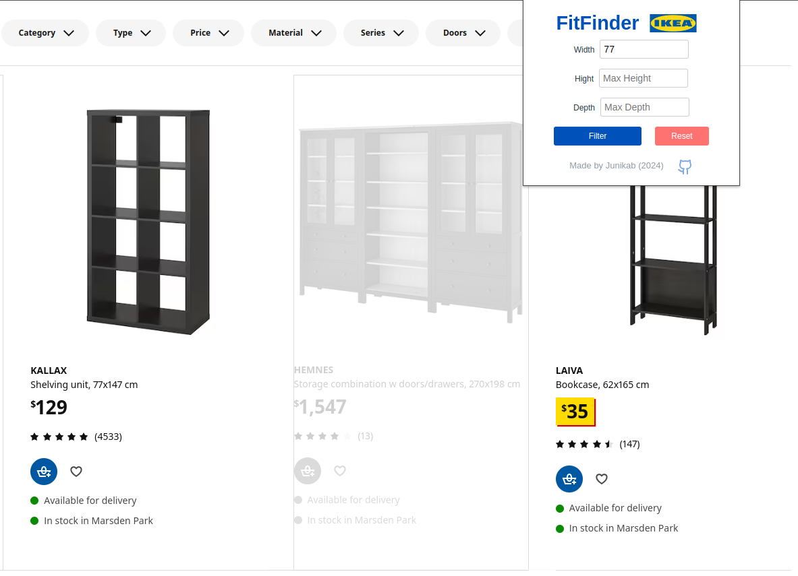

# IKEA FitFinder

IKEA FitFinder is a Chrome extension that enhances your IKEA shopping experience by allowing you to filter furniture based on specific dimensions. This tool is perfect for those looking to find furniture that fits perfectly in their space.



## Features

- Filter IKEA products by maximum width, height, and depth
- User-friendly popup interface
- Instantly highlights products that match your criteria
- Saves your dimension preferences for future use
- Easy reset functionality to clear filters

## Installation

1. Clone this repository or download the source code.
2. Open Google Chrome and navigate to `chrome://extensions/`.
3. Enable "Developer mode" in the top right corner.
4. Click "Load unpacked" and select the directory containing the extension files.
5. The IKEA FitFinder extension should now appear in your Chrome toolbar.

## Usage

1. Navigate to any IKEA product listing page.
2. Click on the IKEA FitFinder icon in your Chrome toolbar to open the popup.
3. Enter your desired maximum dimensions (width, height, depth) in centimeters.
4. Click "Filter" to apply the dimensions.
5. Products on the page will be filtered:
   - Matching products will remain highlighted.
   - Non-matching products will be greyed out.
6. To reset the filter, click "Reset" in the popup or refresh the page.

## Development

This project is built using React and TypeScript. To set up the development environment:

1. Install dependencies:
   ```
   npm install
   ```

2. Run the development server:
   ```
   npm run dev
   ```

3. Build the extension:
   ```
   npm run build
   ```

## Contributing

Contributions are welcome! Please feel free to submit a Pull Request.

## Contact

Created by Junikab (2024) - [GitHub Profile](https://github.com/Junikab)